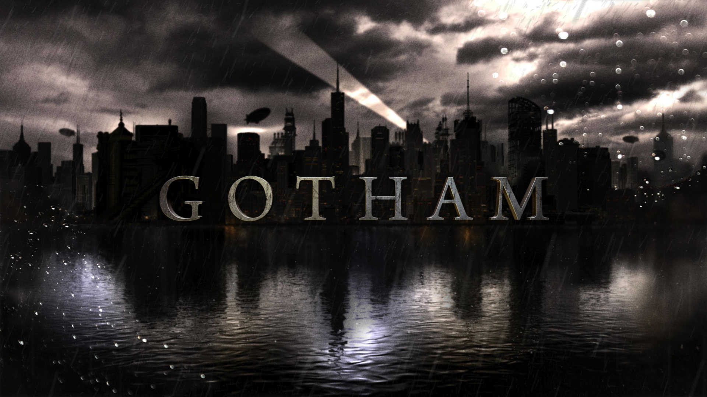

 &copy; Batman - Projet Gotham City
 # Gotham
 Venez voir la véritable histoire de Gotham city !!! : 
 Avec pour Super Hero - BATMAN

# Où est Gotham city ?
Gotham City est située à 60 kilomètres au Nord de Metropolis (où vit Clark Kent), au bord de l’océan Atlantique, à peu près à l’emplacement de New York.

La ville a une situation géographique fluctuante en fonction de ses éditeurs et dessinateurs successifs. Dans les années 1990 elle fut implantée dans le New Jersey en face de Metropolis, séparée de sa ville jumelle par le Delaware Bay.

Gotham City est composée de trois îles principales (Uptown , Midtown et Downtown), le reste de la ville se situant sur le continent.

# Naissance
Gotham fut fondé en 1635 par un mercenaire norvégien et reprise plus tard par les britanniques.

Théâtre de l’une des batailles les plus importantes de la Guerre d’Indépendance des États-Unis d’Amérique, la ville devient une métropole dynamique à l’économie florissante au 19ème siècle.
 

 ## Sommaire
 * 1.Histoire
 * 2.Géographie
 * 3.Géopolitique 

 ### Lien :
[Cliquer sur le lien](https://anilcharif.github.io/gotham/)